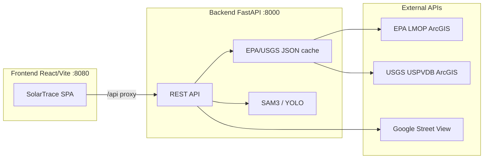

# SolarTrace — PV Waste Flow Intelligence

SolarTrace is a monorepo web application for tracking end-of-life photovoltaic (PV) solar panel waste flows, U.S. landfill acceptance policy estimates, and GeoAI solar panel detection on maps and Street View imagery.

## Architecture



| Layer | Stack |
|-------|-------|
| Frontend | React 18, TypeScript, Vite, Tailwind, shadcn/ui, Leaflet, Recharts, TanStack Query |
| Backend | FastAPI, PyTorch, SAM 3 (transformers), Ultralytics YOLO |
| Data | EPA LMOP landfills, USGS USPVDB solar stats, local PV survey CSV |

## Prerequisites

- **Node.js 20** and npm
- **Python 3.11**
- Optional: **GPU** for faster SAM 3 / YOLO inference
- Optional: **Hugging Face token** with access to `facebook/sam3`
- Optional: **Google Maps API key** with Street View Static API enabled

## Quick start (Docker)

1. Copy environment template and fill in secrets:

   ```bash
   cp .env.example .env
   ```

2. Start services:

   ```bash
   docker compose up --build
   ```

3. Open [http://localhost:8080](http://localhost:8080)

The frontend nginx container proxies `/api` to the backend. Cache and model weights are mounted from `backend/data/cache` and `backend/models`.

## Local development (without Docker)

### Backend

```bash
cd backend
python -m venv venv
source venv/bin/activate   # Windows: venv\Scripts\activate
pip install -r requirements.txt

# Optional: place YOLO weights in backend/ (e.g. yolov8s-worldv2.pt)
export HF_TOKEN=your_hf_token
export GOOGLE_MAPS_API_KEY=your_gmaps_key

uvicorn main:app --reload --port 8000
```

API docs: [http://127.0.0.1:8000/docs](http://127.0.0.1:8000/docs)

### Frontend

```bash
cd frontend
npm install
npm run dev
```

Open [http://localhost:8080](http://localhost:8080). Vite proxies `/api` → `http://127.0.0.1:8000`.

Set `VITE_USE_BACKEND_CACHE=true` to read landfill/solar data from the backend cache instead of live ArcGIS.

## Environment variables

See [`.env.example`](.env.example). Key variables:

| Variable | Service | Purpose |
|----------|---------|---------|
| `GOOGLE_MAPS_API_KEY` | Backend | Street View metadata and thumbnails |
| `HF_TOKEN` | Backend | Download SAM 3 weights from Hugging Face |
| `CORS_ORIGINS` | Backend | Allowed browser origins (comma-separated) |
| `CACHE_REFRESH_SECRET` | Backend | Protects `POST /cache/refresh` cron endpoint |
| `VITE_API_URL` | Frontend | API base URL (default `/api`) |
| `VITE_USE_BACKEND_CACHE` | Frontend | Use backend `/landfills` and `/solar/stats` |

**Security:** Never commit real API keys. Rotate any key that was previously committed to git.

## Model weights

| Engine | File | Notes |
|--------|------|-------|
| YOLO-World | `yolov8s-worldv2.pt` in `backend/` | Recommended for open-vocabulary detection |
| YOLOv8 COCO | `yolov8n.pt` | Fallback if World weights missing |
| SAM 3 | Downloaded at runtime | Requires `HF_TOKEN` and Hugging Face model access |

Check backend status: `GET /health` returns `sam3_loaded`, `yolo_available`, and `streetview_configured`.

## Scheduled cache refresh

Landfill and solar caches refresh on backend startup when older than 24 hours. For production, call:

```bash
curl -X POST http://localhost:8000/cache/refresh \
  -H "X-Cache-Refresh-Secret: $CACHE_REFRESH_SECRET"
```

Schedule this via your hosting platform's cron (Railway, Fly.io, etc.).

## Testing

### Frontend unit tests

```bash
cd frontend
npm run test
```

### Live API integration (optional)

```bash
RUN_LIVE_API_TESTS=1 npm run test
```

### E2E (Playwright)

```bash
cd frontend
npm run test:e2e
```

E2E tests mock ArcGIS responses for deterministic CI.

### Backend tests

```bash
cd backend
pip install -r requirements-dev.txt
pytest tests -q
```

## Deployment

Recommended split:

| Component | Host | Notes |
|-----------|------|-------|
| Frontend SPA | Vercel, Netlify, Cloudflare Pages | Set `VITE_API_URL` to your API URL |
| FastAPI + cache | Railway, Fly.io, AWS ECS | Lightweight endpoints, cron cache refresh |
| CV inference | GPU instance | SAM 3 benefits from GPU; YOLO is lighter |

Checklist:

1. Set all env vars from `.env.example`
2. Configure `CORS_ORIGINS` for your production frontend URL
3. Restrict Google Maps API key by referrer or IP
4. Mount persistent volume for `backend/data/cache`
5. Optional GPU node for `/detect`

## Project structure

```
├── frontend/          React SPA (pages, components, hooks, tests)
├── backend/           FastAPI (detection, cache, Street View)
├── docker-compose.yml Local/staging orchestration
└── .env.example       Environment template
```

## License

University of Manchester research project.
