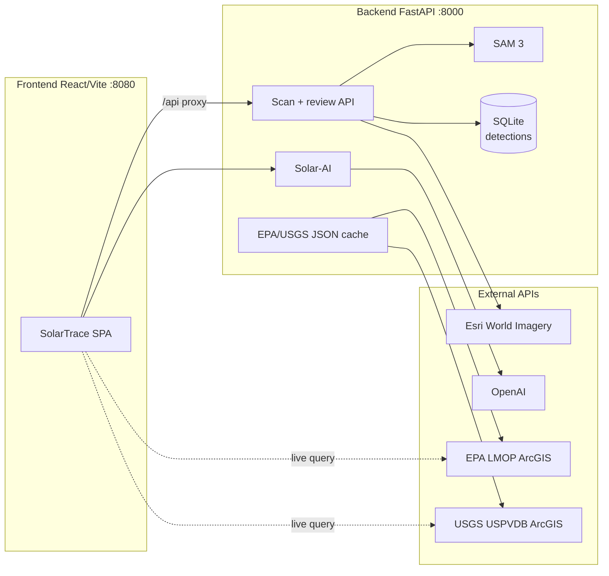

# SolarTrace — PV Waste Flow Intelligence

SolarTrace is a monorepo web application for tracking end-of-life photovoltaic (PV) solar panel
waste flows across U.S. landfills, and for detecting solar arrays in satellite imagery with a
human review workflow.

## Architecture


```mermaid
flowchart LR
  subgraph frontend [Frontend React/Vite :8080]
    SPA[SolarTrace SPA]
  end
  subgraph backend [Backend FastAPI :8000]
    Scan[Scan + review API]
    AI[Solar-AI]
    Cache[EPA/USGS JSON cache]
    DB[(SQLite<br/>detections)]
    SAM[SAM 3]
  end
  subgraph external [External APIs]
    EPA[EPA LMOP ArcGIS]
    USGS[USGS USPVDB ArcGIS]
    ESRI[Esri World Imagery]
    OAI[OpenAI]
  end
  SPA -->|"/api proxy"| Scan
  SPA --> AI
  SPA -.->|live query| EPA
  SPA -.->|live query| USGS
  Scan --> SAM
  Scan --> DB
  Scan --> ESRI
  AI --> OAI
  Cache --> EPA
  Cache --> USGS
```

| Layer | Stack |
|-------|-------|
| Frontend | React 18, TypeScript, Vite, Tailwind, shadcn/ui, react-leaflet, Recharts, TanStack Query |
| Backend | FastAPI, PyTorch, SAM 3 (transformers), shapely/pyproj, SQLite |
| Data | EPA LMOP landfills, USGS USPVDB solar, Esri World Imagery |

## Data provenance

This matters for a research tool, so it is stated explicitly.

**Measured — read live from public APIs:**

| Data | Source | Notes |
|------|--------|-------|
| Landfill name, location, county, status | EPA LMOP ArcGIS | ~2,300 MSW landfills |
| Landfill design capacity, waste in place | EPA LMOP ArcGIS | Where reported |
| Solar capacity + facility counts by state | USGS USPVDB | ~6,600 facilities |
| Solar install year (`p_year`) | USGS USPVDB | Per-state cohorts; drives retirement timing |
| Module chemistry (`p_tech_sec`) | USGS USPVDB | c-Si vs thin-film → lead vs cadmium hazard |
| Satellite imagery | Esri World Imagery | Free, no API key |

**Derived — computed from the above:**

- `ownership` — inferred from LMOP's owner-organisation string by keyword match.
- `landfillsPerGw` — open landfills ÷ installed GW, a disposal-density ratio.
- Remaining landfill headroom — design capacity minus waste in place.

**Modelled — labelled as such everywhere it appears:**

- PV retirement tonnage (`frontend/src/lib/pv-waste.ts`): each real install-year cohort is
  shifted forward by a **30-year module lifetime** at **60 t/MW**, both published IRENA /
  IEA-PVPS figures cited inline in that file.
- Interstate trade routes (`trade-flows.ts`) — estimated from capacity and disposal density.
  **Not observed shipment data**; no public PV-waste shipment registry exists.

**Deliberately absent:** per-landfill PV acceptance policy and tipping fees. No public API
publishes them. Earlier versions of this dashboard shipped a fabricated survey CSV and
hardcoded dollar constants for these; both were removed rather than replaced with invented
values. The UI now reports them as unsurveyed.

## Prerequisites

- **Node.js 20** and npm
- **Python 3.11+** (3.14 works; `geopandas`/`pyogrio` wheels are required — `fiona` is not used
  because it needs a system GDAL)
- Optional: **GPU** for faster SAM 3 inference
- Optional: **Hugging Face token** with access to `facebook/sam3` (only needed to *download*
  the gated weights; once cached locally the app runs without it)
- Optional: **OpenAI API key** for the Solar-AI panel

## Quick start (Docker)

```bash
cp .env.example .env      # then fill in secrets
docker compose up --build
```

Open [http://localhost:8080](http://localhost:8080).

## Local development

### Both at once

From the repo root:

```bash
npm install     # installs the orchestrator and the frontend
npm run dev     # backend on :8000 + frontend on :8080
```

Set `API_PORT` to move the backend. To run the two halves separately, use the
steps below.

### Backend

```bash
cd backend
python -m venv venv
source venv/bin/activate          # Windows: venv\Scripts\activate
pip install -r requirements.txt
uvicorn main:app --reload --port 8000
```

API docs: [http://127.0.0.1:8000/docs](http://127.0.0.1:8000/docs)

Secrets are read from a gitignored `.env` at the repo root (loaded automatically via
`python-dotenv`), so no manual `export` is needed.

### Frontend

```bash
cd frontend
npm install
npm run dev
```

Open [http://localhost:8080](http://localhost:8080). Vite proxies `/api` → `http://127.0.0.1:8000`.

> If port 8000 is taken, run the backend elsewhere and point the frontend at it:
> `VITE_API_URL=http://127.0.0.1:8028 npm run dev`

## Features

### Solar Detections — scan and review

Satellite-only workflow backed by SQLite:

1. Pick a tool — **Single** square, **Multi** (place several, scanned sequentially so partial
   progress survives a failure), or **Erase**.
2. Click the map to place scan squares, set the radius, hit **Scan**. The backend fetches a
   georeferenced Esri export for that exact bbox and runs SAM 3 over it.
3. Review the queue: `Y`/`→` confirm, `N`/`←` delete, `Space` skip, `U` undo, `A` accept all,
   shift-click + `M` to merge split detections.
4. Export confirmed arrays as GeoPackage or CSV.

Re-scanning an area is safe — detections overlapping existing ones (IoU ≥ 0.35) are skipped,
while previously deleted ones stay eligible for re-detection.

### AI agent — chat that drives the map

A chat panel on the right of the Solar Detections page. It does not describe which buttons to
press; it operates the map itself, and you watch it happen.

- **Scanning** — "scan Bakersfield with a 300 m radius" resolves the place, flies there, drops
  the square, and runs the same scan the Scan button runs. Multi-square sweeps run in sequence.
- **Reviewing** — jump to the next pending detection, surface likely false positives, confirm,
  reject or merge by id or from the current selection.
- **Navigating and setting up** — fly to a place, place or clear squares, change the radius,
  switch tool.
- **Answering** — totals, coverage in km², counts inside the visible area. Figures come from
  tool calls against SQLite, never from the model's memory.

Anything destructive (erasing in a circle, rejecting detections) and any sweep over three
squares stops for an explicit confirmation first. Replies stream over SSE, the transcript
survives a reload, and `Clear` starts a fresh session. Requires `OPENAI_API_KEY`; the panel
says so plainly if it is missing.

### Solar-AI

A dashboard Q&A panel over the app's own data. Every number the model may cite is passed in a
`fact_ledger` with its source; a deterministic post-check re-extracts numbers from the answer
and downgrades confidence to `low` if any of them fail to match a ledger fact. Requires
`OPENAI_API_KEY`.

### Light / dark mode

Toggle in the app header, persisted to localStorage. The sidebar rail stays dark in both modes.

## Environment variables

See [`.env.example`](.env.example).

| Variable | Purpose |
|----------|---------|
| `HF_TOKEN` | Download SAM 3 weights from Hugging Face (not needed once cached) |
| `OPENAI_API_KEY` | Solar-AI panel and the map agent |
| `OPENAI_MODEL` | Override the Solar-AI model (and the agent's, unless `AGENT_MODEL` is set) |
| `AGENT_MODEL` | Override just the map agent's model |
| `AGENT_REASONING_EFFORT` | Defaults to `none` — reasoning models reject function tools on `/v1/chat/completions` otherwise |
| `GOOGLE_MAPS_API_KEY` | Street View proxy endpoint (optional, not used by the scan workflow) |
| `CORS_ORIGINS` | Allowed browser origins (comma-separated) |
| `CACHE_REFRESH_SECRET` | Protects `POST /cache/refresh` |
| `SAM3_SAT_TILING` | Tiled inference. **Default on** — see below |
| `SAM3_SAT_MAX_DIM` | Tile size, default 1024 |
| `SAM3_SAT_CONF` | Detection confidence floor, default 0.20 |
| `VITE_API_URL` | Frontend API base (default `/api`) |
| `VITE_USE_BACKEND_CACHE` | Read landfill/solar data from the backend cache first |

**Security:** never commit real keys. `.env` is gitignored; rotate anything that has leaked.

### Why tiling defaults on

A single downscaled inference pass destroys the resolution panels need. Measured on a 1600 m
scan (2048 px Esri export):

| Config | Detections | Time |
|--------|-----------|------|
| Single pass @768 | 0 | 6.5 s |
| Tiled @768 | 30 | 98.3 s |
| **Tiled @1024 (default)** | **35** | **55.0 s** |

Larger tiles mean fewer inference passes, so 1024 is both more accurate *and* faster than 768.
Set `SAM3_SAT_TILING=0` for the old fast-but-blind single pass.

## API

| Method | Path | Purpose |
|--------|------|---------|
| `GET` | `/health` | Model + cache status |
| `POST` | `/scan` | Fetch imagery for a bbox, detect, filter, persist |
| `POST` | `/paint` | Click-to-segment preview (not persisted) |
| `GET` | `/detections` | Stored detections as GeoJSON (`?status=`, `?bbox=`) |
| `POST` | `/detections/{id}/confirm` \| `/reject` \| `/restore` | Review actions |
| `POST` | `/detections/confirm-batch` | Bulk review |
| `POST` | `/detections/merge` | Union 2+ overlapping detections |
| `POST` | `/detections/erase-circle` | Delete everything inside a circle |
| `POST` | `/detections/manual` | Save a hand-drawn polygon |
| `GET` | `/coverage` · `/detection-stats` | Scanned area and review counts |
| `GET` | `/detections/export/confirmed.gpkg` \| `.csv` | Export |
| `POST` | `/solar-ai/analyze` | Solar-AI Q&A |
| `POST` | `/detect` | Stateless single-image detection |
| `GET` | `/landfills` · `/solar/stats` | Cached EPA/USGS data |

## Testing

```bash
cd backend && pytest tests -q         # 36 tests
cd frontend && npm run test           # 36 tests
cd frontend && npm run test:e2e       # Playwright
```

## Deployment

| Component | Host | Notes |
|-----------|------|-------|
| Frontend SPA | Vercel, Netlify, Cloudflare Pages | Set `VITE_API_URL` |
| FastAPI + SQLite | Railway, Fly.io, AWS ECS | Mount a volume for `backend/data/` |
| SAM 3 inference | GPU instance | Tiled scans are compute-heavy |

Checklist: set env vars from `.env.example`; configure `CORS_ORIGINS`; mount persistent storage
for `backend/data/` (cache **and** the detections DB); use a GPU node for `/scan`.

## Project structure

```
├── frontend/          React SPA (pages, components, hooks, lib, tests)
├── backend/           FastAPI — scan/review API, SAM 3, Solar-AI, caches
│   └── data/          SQLite detections DB + EPA/USGS JSON cache (gitignored)
├── docker-compose.yml
└── .env.example
```

## License

University of Manchester research project.
